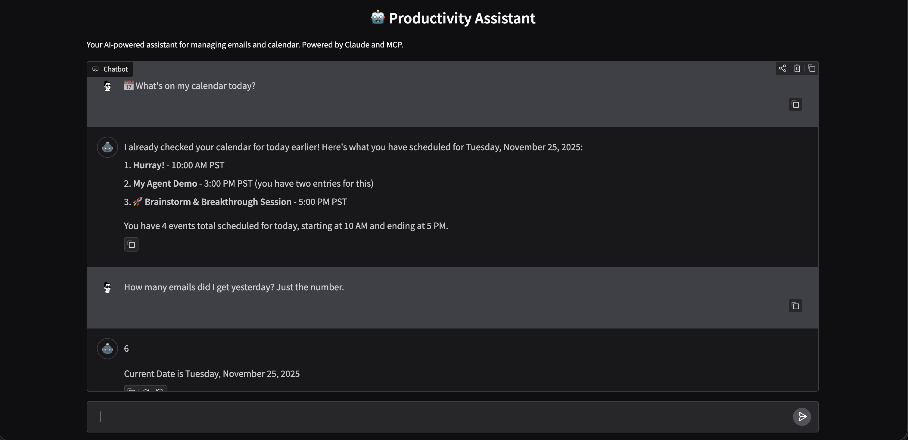

# ✨ Productivity Assistant Agent ✨

A personal productivity assistant designed for seamless interaction with your Gmail and Google Calendar using natural language. This agent empowers you to manage your schedule and emails through an interactive Gradio-based Graphical User Interface (GUI), powered by Anthropic's Claude and local, in-process Message Context Processor (MCP) servers.



---

## 🚀 Architecture at a Glance

This project implements an intelligent AI agent where:

-   🎨 The `main.py` script runs an **interactive Gradio-based GUI chat interface**.
-   🧠 User commands in natural language are sent to **Anthropic's Claude**, which acts as the intelligent orchestrator.
-   🛠️ Claude intelligently decides which local **MCP tools** (for Gmail or Google Calendar) to use based on your request.
-   🔄 The `MCPAgent` manages the lifecycle of these local MCP servers. It starts and communicates with them directly via standard I/O (stdio), executing tools **in-process** within the main application.
-   🌐 The local MCP servers (built with `FastMCP`) then interact with the respective **Google APIs** (Gmail & Google Calendar) to perform actions like listing emails, creating events, etc.

---

## 📁 Project Structure

```
productivity-assistant/
├── pyproject.toml       # Project dependencies 📦
├── .env                 # Environment variables (!!! ESSENTIAL & NOT COMMITTED !!!) 🔒
├── .env.example         # Template for your .env file 📄
├── README.md            # This file you're reading! 📖
└── productivity_assistant/
    ├── __init__.py          # Python package initializer
    ├── mcp_agent.py         # Core agent logic: sends requests to Claude, handles responses 🤖
    ├── main.py              # Application entry point: runs the interactive Gradio chat GUI 💬
    ├── models.py            # Pydantic data models for structured data (emails, calendar events) 📊
    ├── servers/             # Contains the local MCP server definitions 🖥️
    │   ├── calendar_server.py   # FastMCP definition for Google Calendar
    │   └── gmail_server.py      # FastMCP definition for Gmail
    └── tools/               # Contains shared tools and API interaction logic 🔧
        ├── calendar_tool.py     # Logic for interacting with Google Calendar API
        ├── gmail_tool.py        # Logic for interacting with Gmail API
        └── google_api_service.py # Reusable function for Google API authentication & service creation
```

---

## 🛠️ Setup Instructions

### 1. Pre-requisites

*   🐍 **Python 3.13+**: Highly recommended to use a version manager like `pyenv` or `conda`.
*   ⚡ **`uv`**: For fast and reliable dependency management.
    ```bash
    curl -LsSf https://astral.sh/uv/install.sh | sh
    ```
*   ☁️ **Google Cloud Project Setup**:
    1.  Go to the [Google Cloud Console](https://console.cloud.google.com/).
    2.  **Enable** both the **Google Calendar API** and **Gmail API** for your project.
    3.  Create an **OAuth 2.0 Client ID** of type **"Desktop app"** under "APIs & Services" -> "Credentials".
    4.  **Download** the `client_secret.json` file.
    5.  Place this `client_secret.json` file in a directory named `token files` in your project's root directory (e.g., as `./token files/client_secret.json`).

### 2. Configure Environment Variables

1.  **Create your `.env` file**:
    ```bash
    cp .env.example .env
    ```
2.  **Edit `.env`**: Open the newly created `.env` file and fill in your details:
    ```ini
    # Your Anthropic API Key (e.g., sk-ant-api03-...)
    ANTHROPIC_API_KEY=your_anthropic_api_key_here


    # Path to your Google API client_secret.json file.
    # This single file is used for both Calendar and Gmail APIs.
    GOOGLE_API_CLIENT_SECRET_FILE=./client_secret.json
    ```

### 3. Install Python Dependencies

1.  **Create and activate your virtual environment**:
    ```bash
    uv venv
    source .venv/bin/activate
    ```
2.  **Install all project dependencies**:
    ```bash
    uv pip install -e .
    ```

---

## ▶️ Running the Agent (with GUI)

This is where the magic happens! Your `main.py` script now launches the Gradio GUI and manages the entire application, including starting and stopping the local MCP servers.

1.  **Open a single terminal window.**
2.  **Activate your virtual environment**:
    ```bash
    source .venv/bin/activate
    ```
3.  **Navigate to your project's root directory.**
4.  **Run the chat agent script**:
    ```bash
    python productivity_assistant/main.py
    ```
5.  **Google Authentication (First Time Only):**
    *   The first time your agent initializes the Calendar and Gmail APIs, a browser window will open for *each* service (Calendar then Gmail) asking you to authenticate with Google.
    *   Follow the prompts to grant the necessary access.
    *   This process will create `token.json` files (e.g., `token_gmail_v1.json`, `token_calendar_v3.json`) in a `token_files` directory inside `productivity_assistant/tools`. These tokens securely store your authentication credentials for future use.

---

## 💬 Interacting with the Agent (via GUI)

Once the Gradio GUI window for the "Productivity Assistant Chat" appears, you can interact with your agent:

1.  Type your natural language commands into the input field at the bottom.
2.  Press `Enter` or click the "Send" button.
3.  Claude will interpret your requests and decide which local MCP tool to call, and your agent will manage the communication, displaying responses in the chat history area.

**Example Commands:**

*   `List my 5 most recent emails.`
*   `Create a meeting called 'Project Sync' for tomorrow at 10 AM for 1 hour.`
*   `Create an event for dinner with friends on December 25th at 7 PM in New York.`
*   `Search my calendar for events about 'CLI'.`
*   `Get the body of email with ID: <email_id_from_list_emails>.`
*   `Delete the event called 'Foo' scheduled for me Today`

---

Enjoy your new Productivity Assistant Agent! 🎉